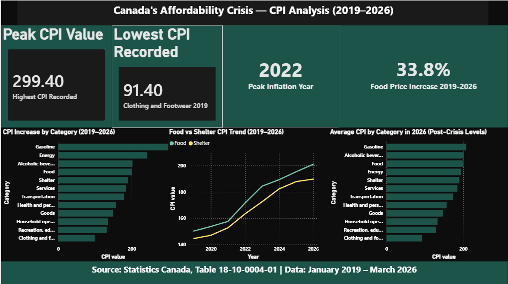

# Canada's Affordability Crisis — SQL Analysis (2019–2026)

## Project Overview
This project analyses Canada's Consumer Price Index (CPI) data from 
January 2019 to March 2026 to identify which expense categories impacted 
Canadian households the most during the affordability crisis.

**What is CPI?** The Consumer Price Index measures how much everyday costs 
have changed over time compared to a base year (2002 = 100). A CPI of 200 
means prices are double what they were in 2002.

## Business Question
Which spending categories increased the most for Canadians between 2019 
and 2026, and what do the trends tell us about the cost of living crisis?

## Tools Used
- MySQL — data analysis and querying
- Python (Pandas) — data cleaning
- Power BI — interactive dashboard
- Data Source: Statistics Canada (Official Government Data)

## Dataset
- Source: Statistics Canada, Table 18-10-0004-01
- Period: January 2019 – March 2026
- Records: 1,305 rows across 10 spending categories

## Key Findings

### 1. Gasoline and Energy Were the Most Volatile Categories
Gasoline saw the largest absolute CPI increase of 185.8 points between 
2019 and 2026 (from 113.6 to 299.4), driven by the 2022 Russia-Ukraine 
war and global energy supply shocks. Energy followed with a 114.2 point 
increase. Between 2019 and 2024 specifically, Gasoline rose 33.68% and 
Energy rose 28.23%.

### 2. Food and Shelter Hit Households the Hardest
Food rose 33.8% (150.22 to 201.00) and Shelter rose 31.3% (144.51 to 
189.73) between 2019 and 2026 — the two unavoidable household expenses 
Canadians cannot cut back on. Food saw its sharpest single-year jump in 
2022, rising 13.98 points in one year (157.54 to 171.52). Shelter 
increased every single year without exception — Canada's housing crisis 
visible in raw numbers.

### 3. 2022 Was the Peak Crisis Year
The overall CPI jumped 9.63 points in 2022 — the largest single-year 
increase in the dataset — coinciding with post-pandemic supply chain 
collapse and record Bank of Canada rate hikes. No other year came close: 
2021 saw 4.65 points and 2023 saw 5.87 points.

### 4. Clothing Was the Only Category That Got Cheaper
Clothing and footwear fell 2.86% between 2019 and 2024 (96.05 to 93.30) 
— the only deflationary category in the entire dataset. This reflects 
global manufacturing competition keeping discretionary goods prices low 
even as essentials became unaffordable.

### 5. 2022 Inflation Was Relentless — No Relief Month
CPI climbed almost every single month throughout 2022, rising from 145.3 
in January to a peak of 154.0 in November — an 8.7 point increase with 
only one minor dip in August (152.6). This sustained pressure forced the 
Bank of Canada to implement seven consecutive rate hikes throughout the year.

### 6. Rate Hikes Cooled Energy but Failed on Shelter
Post-2022, Gasoline dropped 18.85 points and Energy dropped 8.94 points 
from 2022 to 2023 — responding to Bank of Canada rate hikes. However, 
Shelter costs accelerated, rising 9.20 points from 2022 to 2023 and then 
9.78 points from 2023 to 2024 — faster than the crisis year itself. This 
signals Canada's housing affordability problem is structural and cannot be 
solved by monetary policy alone.

### 7. Gasoline Dominated the Rankings — Shelter Quietly Climbed
Gasoline jumped from rank 2 in 2019 to rank 1 by 2021 and held that 
position through 2026. More concerning is Shelter — it sat at rank 6 in 
2019 and has remained in the top 5 every year since, reflecting a sustained 
structural housing cost problem that outlasted every other inflationary 
pressure.

### 8. Food Price Acceleration Was Fastest Between 2022–2023
A 3-month rolling average analysis of Food CPI shows prices accelerated 
most sharply between January 2022 and June 2023 — rising from 162.07 to 
184.17 in just 18 months. The rolling trend confirms this was a sustained 
structural increase, not a temporary spike. Food CPI crossed 200 for the 
first time ever in March 2026, reaching 201.50.

### 9. Food and Shelter Never Recovered — Still Above 2022 Peak
By 2026, Food CPI sits 23.1 points above its 2022 crisis peak (177.90 → 
201.00) and Shelter sits 21.93 points above its peak (167.80 → 189.73) — 
meaning these essential costs never came down after the crisis. In contrast, 
Gasoline dropped 91.47 points below its 2022 peak (299.40 → 207.93). 
Canadians got relief at the gas pump but continued to face record highs 
at the grocery store and in their housing costs through 2026.

## Business Recommendation
Banks and fintechs should prioritise financial wellness tools targeting 
Food and Shelter budgeting for Canadian households. These two categories 
account for the most sustained and unavoidable cost increases since 2019 
and show no signs of reverting. Products such as smart budgeting alerts, 
grocery spend tracking, and rent affordability calculators would directly 
address the pain points this data reveals.

## Dashboard
🔗 [View Live Power BI Dashboard](https://app.powerbi.com/view?r=eyJrIjoiODI0YmM3MDMtN2VjZi00YzdjLWEzNjktNzlmNDc5YTk0ZGE1IiwidCI6ImM2ZTU0OWIzLTVmNDUtNDAzMi1hYWU5LWQ0MjQ0ZGM1YjJjNCJ9)

## SQL Techniques Used
- Aggregate functions: SUM, AVG, MIN, MAX, COUNT
- Filtering: WHERE, CASE WHEN, LIKE
- Grouping: GROUP BY, HAVING
- Window functions: LAG, RANK, AVG OVER (ROWS BETWEEN)
- Date functions: STR_TO_DATE, YEAR, CONCAT
- Subqueries and derived tables

## Files
| File | Description |
|------|-------------|
| `cpi product by group.csv` | Raw data from Statistics Canada |
| `cpi_clean.csv` | Cleaned and reshaped data |
| `cleaning cpi data.ipynb` | Python data cleaning notebook |
| `canada_cpi_analysis.sql` | SQL analysis queries with comments |

## Status
✅ Complete — SQL analysis done (9 queries)
✅ Complete — Power BI dashboard live
